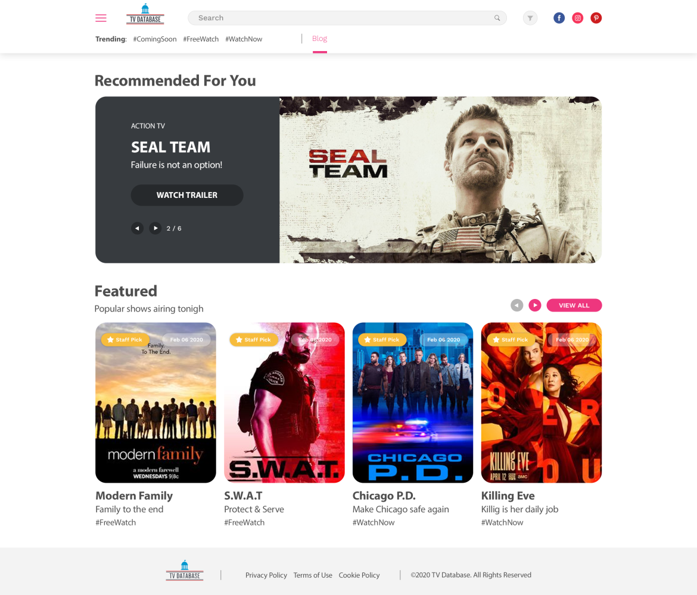
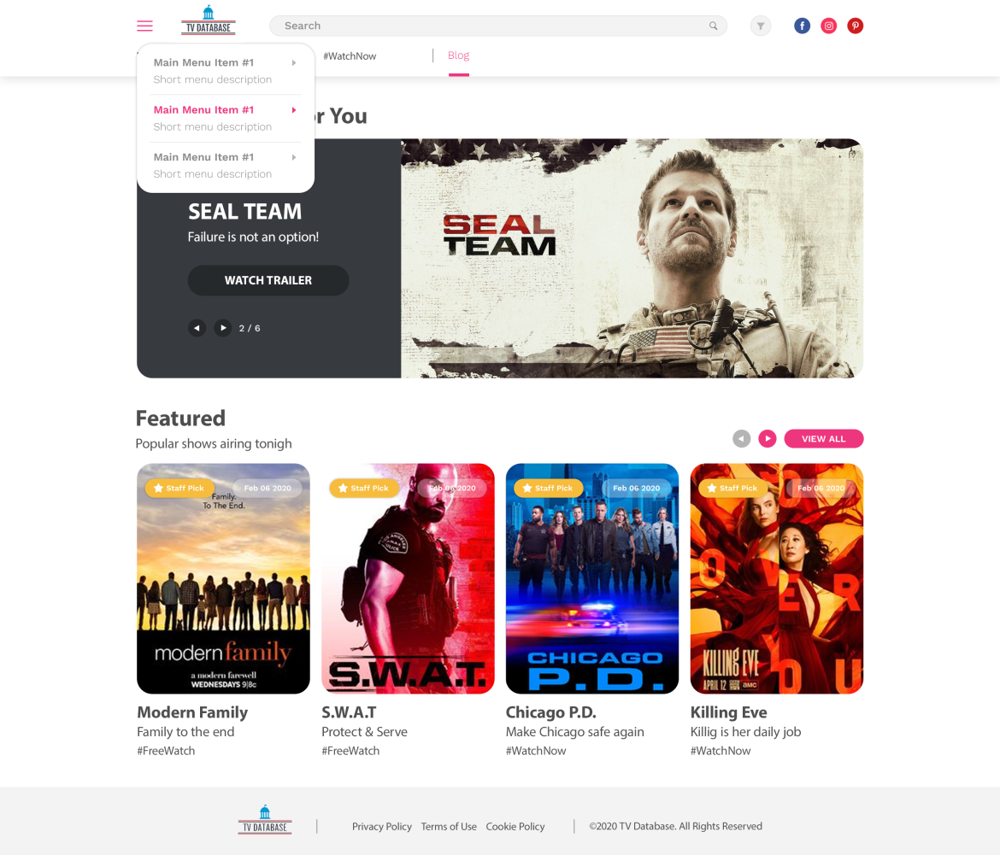

<h1 align="center">Welcome to react-assessment-tv-nextjs 👋</h1>
<p>
  
  <a href="www.google.com" target="_blank">
    
  </a>
  <a href="https://twitter.com/duranzno\_" target="_blank">
    
  </a>
</p>

## 🏠 [Homepage](https://github.com/Duranzno/react-assessment-tv-nextjs)

## 🚧 [Project](https://github.com/Duranzno/react-assessment-tv-nextjs/projects/1?fullscreen=true)

## ✨ [Demo](https://react-assessment-tv-nextjs.now.sh/)

## 📝 [Documentation](https://duranzno.github.io/react-assessment-tv-nextjs/)

### React Assessment Description

Create a project from scratch to represent a web app with the following design:

### _Requirements_

- [x] 1. Use Next.js framework for development: [https://nextjs.org/](https://nextjs.org/)

- [x] 2. Do not use classes, use React Hooks [https://reactjs.org/docs/hooks-intro.html](https://reactjs.org/docs/hooks-intro.html)
- [x] 3. Use Material-UI for designing the components: [https://material-ui.com/](https://material-ui.com/)
- [x] 4. Use Redux for managing the application state: [https://redux.js.org/](https://redux.js.org/)
- [x] 5. Add unit testing for the components using Jest ([https://jestjs.io/en/](https://jestjs.io/en/)) or React Testing Library ([https://github.com/testing-library/react-testing-library](https://github.com/testing-library/react-testing-library))
- [x] 6. Set up ESLint ([https://eslint.org/](https://eslint.org/)) and Prettier ([https://prettier.io/](https://prettier.io/)) and follow Airbnb's style guide.
- [x] 7. Use TVMaze API ([http://www.tvmaze.com/](http://www.tvmaze.com/)) for fetching the data.

### _App_

- [x] 1. Feel free to show any movie or picture you prefer (don't need to follow the design attached).
- [x] 2. Feel free to show any information you prefer about the movie in both the card and the text below.
- [x] 3. The "hamburger button" must pop up the menu shown in the design. The pop up has no functionality, it only shows the menu.
- [x] 4. For the slider (carousel), choose the movies you prefer to show. The left and right buttons should go to the next or previous movie. At least add 3 movies to the slider.
- [x] 5. In the Featured section, there should be at least 6 movies but only 4 are shown at a time. The buttons left and right should show the hidden movies.
- [x] 6. Whenever a movie is clicked (both on the slider or the featured section) show extended information about the specific movie. It must be shown in a new fragment/page. Feel free to show the information you want and to choose the design you want. You don't have to create a new design for it if you don't want to, plain text without any format can be used.

### _Notes:_

1. Every single button/link which doesn't have any functionality explained in the previous section (App) is a dummy button, meaning it only has an esthetic purpose.
2. Feel free to use any third party library that might help you to speed up the development.
3. You can use Storybook if you’re feeling brave (not required) [https://storybook.js.org/](https://storybook.js.org/)
4. Make sure the app is responsive.
5. Execute the development as if you were doing a real project which is going to be deployed on production.
6. Have fun :)




---

## Design Modifications

Part of the interface shows the use of tags that would work similarly to the Hastags used in social networks, like #FreeWatch and #WatchNow but the TvMazeApi doesn't have them. The most similar item that wouldn't change hardly the design would be the TVNetwork where it is streamed the series.

## Install

```sh
yarn install
```

## Usage

```sh
yarn dev
```

## Run tests

```sh
yarn test
```

## Author

👤 **Alejandro Duran**

- Website: duranzno.now.sh
- Website: [duranzno.now.sh](https://duranzno.now.sh)
- Twitter: [@duranzno\_](https://twitter.com/duranzno_)
- Github: [@duranzno](https://github.com/duranzno)
- LinkedIn: [@duranzno](https://linkedin.com/in/duranzno)

## Show your support

Give a ⭐️ if this project helped you!

---

_This README was generated with ❤️ by [readme-md-generator](https://github.com/kefranabg/readme-md-generator)_
